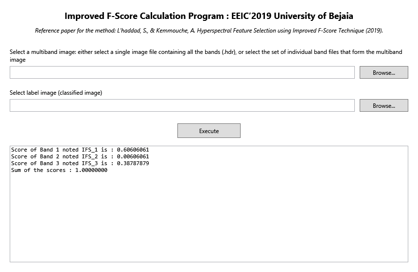

# Improved F‑Score Calculation

Windows desktop program that computes the **Improved F‑Score (IFS)** of every band of a multiband
(multispectral or hyperspectral) satellite image from a classified image, and converts the scores
into normalized band weights.

| | |
|---|---|
| **Version** | 2.0.0 |
| **Programming language** | C# |
| **Framework** | .NET 10 (`net10.0-windows`), WPF user interface |
| **Platform** | Windows 64‑bit |
| **Executable** | [`Executable/IFS.exe`](Executable/IFS.exe): a single self-contained file that runs without .NET installed |

## The Improved F‑Score technique

The improved F-Score technique is a band-weighting method that assigns to each band of a multiband image a degree of relevance, indicating the importance of that band within the multiband image. The works listed below describe this method in detail:

- L'haddad, S., & Kemmouche, A. (2019, December) Hyperspectral Feature Selection using Improved F-Score Technique.
- Alioua, N. E. H., L’Haddad, S., Kemmouche, A., Capolupo, A., & Tarantino, E. (2024, December). Classifying Remote Sensing Data Through Advanced Dimensionality Reduction Approaches. In Italian Conference on Geomatics and Geospatial Technologies (pp. 378-395). Cham: Springer Nature Switzerland.
- Alioua, N. E. H., L’Haddad, S., Kemmouche, A., Capolupo, A., & Tarantino, E. (2025, June). Comparative Study of Different Constructions of Morphological Leveling Decompositions for Spatial Multi-scale Image Analysis. In International Conference on Computational Science and Its Applications (pp. 157-174). Cham: Springer Nature Switzerland.

### Computation performed by the program

For each band *i* of the multiband image, with the pixels grouped into *l* classes by the
classified image (*n_j* pixels in class *j*):

$$F_i = \frac{\displaystyle\sum_{j=1}^{l} \left( \bar{x}_i^{(j)} - \bar{x}_i \right)^2}{\displaystyle\sum_{j=1}^{l} \frac{1}{n_j - 1} \sum_{k=1}^{n_j} \left( x_{k,i}^{(j)} - \bar{x}_i^{(j)} \right)^2}$$

- $\bar{x}_i$: mean value of band *i*;
- $\bar{x}_i^{(j)}$: mean value of band *i* over the pixels of class *j*;
- $x_{k,i}^{(j)}$: value of the *k*-th pixel of class *j* in band *i*.

The numerator measures the separation between the classes, the denominator the dispersion inside
each class: the larger $F_i$, the more discriminant the band. The scores are then normalized,
$w_i = F_i / \sum_k F_k$, so that each weight lies between 0 and 1 and the weights sum to 1.

## User interface



1. **Title:** *Improved F‑Score Calculation Program : EEIC’2019 University of Bejaia*, followed by
   the reference paper of the method.
2. **Select a multiband image:** click **Browse...** and select either
   - a single **ENVI `.hdr` file** containing all the bands (BSQ, BIL or BIP interleave; byte,
     16/32/64-bit integer, 32/64-bit float data; the data file must be in the same folder), or
   - the **set of individual band files** (multiple selection: TIFF, PNG, BMP, GIF, JPEG in 8-bit,
     16-bit or floating point). Bands are numbered in file-name order (B1, B2, ..., B10). A
     multi-page TIFF provides one band per page. Any number of bands is accepted.
3. **Select label image (classified image):** click **Browse...** and select the classified image
   (TIFF, PNG, BMP, GIF or ENVI `.hdr`), produced by any classifier. Each distinct colour (or value)
   is one class. JPEG is not recommended, because its compression creates false classes.
4. **Execute:** computes the scores. The weights are displayed in the window and the message
   *"The scores (weights) obtained for the bands of the multiband image are stored in the "Scores
   of Bands" file."* appears.

## Output

The scores are saved in `Scores of Bands\IFS_Scores_<image name>.txt`, next to the solution file
(or next to the executable when it is copied alone elsewhere):

```
Score of Band 1 noted IFS_1 is : 0.60606061
Score of Band 2 noted IFS_2 is : 0.00606061
Score of Band 3 noted IFS_3 is : 0.38787879
Sum of the scores : 1.00000000
```

The file also contains the weights in a ready-to-paste form (`0,60606061;0,00606061;0,38787879`),
the raw Improved F‑Score of each band, and the list of classes with their number of pixels.

## Run the program without compiling

Download [`Executable/IFS.exe`](Executable/IFS.exe) (click the file, then **Download raw file**) and double-click it.
No installation is required. Windows SmartScreen may ask for confirmation the first time, because the
executable is not signed: click **More info**, then **Run anyway**.

## Build and run

Requirements: Windows, [.NET 10 SDK](https://dotnet.microsoft.com/download), and optionally VS Code
with the C# Dev Kit extension.

```
dotnet build IFS\IFS.csproj                              # compile
dotnet run --project IFS\IFS.csproj                      # run
dotnet publish IFS\IFS.csproj -c Release -o Executable   # create Executable\IFS.exe
```

In VS Code: open the folder, press **F5** to compile and run, or run the **publish** task to create
the executable.

## Repository content

```
IFS.sln                     solution
global.json                 .NET SDK version
.vscode\                    VS Code build, publish and launch settings
IFS\                        source code (MainWindow.xaml, MainWindow.xaml.cs, App.xaml, IFS.csproj)
LISEZMOI.txt                instructions (French)
RAPPORT_MODIFICATIONS.txt   change report of version 2 (French)
Executable\IFS.exe          ready-to-use Windows 64-bit executable
```

## Notes

- The classified image should be fully classified: a background or "unclassified" value is
  treated as a class of its own.
- Classes with a single pixel are ignored (their variance is undefined).
- Multi-band GeoTIFF files (several bands in one page) are not readable by the Windows image
  decoder: convert them to ENVI format (for example `gdal_translate -of ENVI`).
